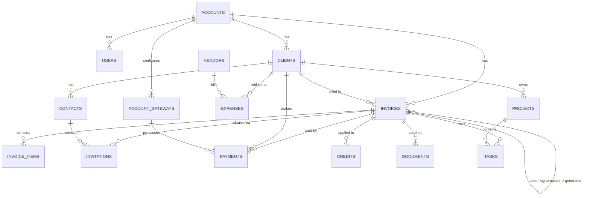

# InvoiceNinja v4 (Legacy) Database — Reference for KapturInvoice

Source: `chronopr_ninj226.sql` (phpMyAdmin dump, MariaDB 10.5, InvoiceNinja **v4**
schema — the classic Laravel 5-era Eloquent/Omnipay codebase, not the v5 rewrite).
73 tables. This document distills that schema into something usable as a design
reference for the KapturInvoice rebuild (TALL stack: Tailwind, Alpine,
Laravel, Livewire) and as a map for writing the data-import scripts. **§4
below was written when the admin/billing dashboard was planned on Filament;
the app has since fully migrated off Filament onto a hand-built
TallStackUI/Livewire admin (`app/Filament` no longer exists) — §4 has been
rewritten to describe the real current approach. See CLAUDE.md's
"TallStackUI + Livewire 4, not Filament" conventions for the authoritative
current shape.**

It is **not** a 1:1 spec to copy — InvoiceNinja v4 carries a lot of SaaS-hosting
and legacy baggage that KapturInvoice almost certainly doesn't need. Each
section below flags what's core, what's legacy cruft, and what to redesign.

---

## 1. High-level architecture patterns

These patterns repeat across almost every table and are more important than
any single column list:

- **Tenant boundary = `accounts`.** Every business table carries `account_id`
  with `ON DELETE CASCADE`. One `account` = one company/tenant. `users` also
  belongs to exactly one account (`users.account_id`) — this is a
  single-company-per-account model with an `is_admin` flag and a JSON
  `permissions` column for coarse RBAC (not a real roles table).
- **Dual ID scheme.** Every tenant-owned table has the normal auto-increment
  `id` (global PK) **plus** a `public_id` that is only unique *within an
  account* (`UNIQUE (account_id, public_id)`). `public_id` is what was exposed
  in URLs/API so one tenant could never guess another tenant's row by ID.
  Companion per-entity counters live on `accounts`/`clients`:
  `invoice_number_counter`, `quote_number_counter`, `credit_number_counter`,
  `client_number_counter`, each paired with a `_prefix` and `_pattern` column
  for generating human-readable numbers (e.g. `INV-000123`).
- **Soft deletes, doubly.** Most tables have both a real `deleted_at` (Laravel
  soft-deletes) **and** a legacy boolean `is_deleted`. Treat this as historical
  redundancy from a pre-Eloquent-soft-deletes era — pick one in the rebuild.
- **Repeated inline tax columns.** `tax_name1/tax_rate1` and
  `tax_name2/tax_rate2` are duplicated on `accounts`, `clients`, `invoices`,
  `invoice_items`, `products`, `expenses`. This is v4's "max 2 taxes per line"
  design. **Recommend normalizing** this into a real `tax_rates` pivot
  (`taxable_type`, `taxable_id`, `tax_rate_id`, `amount`) in the rebuild if you
  want more than 2 taxes, per-jurisdiction reporting, or inclusive/exclusive
  math that isn't hard-coded.
- **Activity log.** `activities` is a single wide table with nullable FKs to
  everything it might reference (`client_id`, `invoice_id`, `payment_id`,
  `credit_id`, `invitation_id`, `task_id`, `expense_id`) plus a JSON
  `json_backup` snapshot and an integer `activity_type_id` (enum-by-convention,
  not an FK). In Laravel this maps cleanly to a package like
  `spatie/laravel-activitylog` instead of a bespoke table.
- **Lookup/shard tables are SaaS-hosting plumbing — likely skip entirely.**
  `lookup_accounts`, `lookup_users`, `lookup_contacts`, `lookup_invitations`,
  `lookup_proposal_invitations`, `lookup_companies`, `lookup_account_tokens`,
  `db_servers` existed so InvoiceNinja's *hosted* multi-database SaaS could
  guarantee global uniqueness of emails/tokens/subdomains across many
  physical DB shards. A single-tenant or Filament-multi-tenant app doesn't
  need this layer at all — don't import it.
- **SaaS billing/licensing tables — likely skip.** `companies` (this is
  InvoiceNinja's *own* subscription plan for the account, not your client's
  company), `affiliates`, `licenses` are for InvoiceNinja-the-product's
  reseller/plan business, unrelated to invoicing your clients. Skip unless you
  are literally reselling.
- **`user_accounts`** (`user_id1`..`user_id5`, no FKs at all) is vestigial —
  looks like an abandoned "link multiple accounts to a user" experiment.
  Safe to ignore/drop.
- **Standard Laravel plumbing** — `migrations`, `jobs`, `failed_jobs`,
  `password_resets` — these are just framework tables; a fresh Laravel app
  already has current equivalents (Laravel 11+ also renames/adds
  `job_batches`, `personal_access_tokens`, etc.) — don't import data, just let
  migrations create them.

---

## 2. Table catalog by domain

Legend: **PK** id always `int unsigned`, **FK→X** = foreign key to table X
(all `ON DELETE CASCADE` unless noted). Boilerplate `created_at/updated_at/
deleted_at` timestamps are omitted from the notes below unless relevant.

### 2.1 Tenant & identity
| Table | Key columns | Notes |
|---|---|---|
| `accounts` | `account_key` (unique), `subdomain`, `name`, address fields, `logo*`, `primary_color`/`secondary_color`, `industry_id`→industries, `size_id`→sizes, `language_id`→languages, `timezone_id`→timezones, `currency_id`→currencies, `country_id`→countries, `invoice_design_id`/`quote_design_id`→invoice_designs, `header_font_id`/`body_font_id`→fonts, `email_design_id`, `page_size`, `enabled_modules`/`enabled_dashboard_sections` (bitmask ints — recommend real booleans/JSON settings instead), numbering counters/prefixes/patterns for invoice/quote/client/credit, reminder1-4 config (enable/days/direction/field), `tax_name1/2`+`tax_rate1/2` (account-level default taxes), `custom_fields`/`custom_messages`/`custom_design1-3` (JSON/mediumtext blobs), `enable_client_portal*`, `financial_year_start`, `payment_terms`, `domain_id` | The tenant record. ~140 columns — a grab-bag of every setting. In the rebuild, split into `accounts` (identity) + `account_settings` (branding/PDF) + `numbering_settings` (counters/patterns) for sanity. |
| `account_email_settings` | FK→accounts, subjects/templates for invoice/quote/payment/reminders 1-4, late fee 1-3 (amount+percent) | 1:1 with accounts. Maps well to a Filament settings page / a `notification_settings` table. |
| `users` | FK→accounts, `username` (unique), `email`, `password`, `is_admin`, `permissions` (JSON), `oauth_user_id`+`oauth_provider_id` (unique pair), `google_2fa_secret`, `dark_mode`, `notify_*` flags | Laravel `users` table, tenant-scoped. Bring your own RBAC (Filament Shield / spatie/permission) instead of the JSON `permissions` blob. |
| `user_accounts` | `user_id1..5`, no FKs | Vestigial — skip. |
| `companies` | InvoiceNinja's own plan/billing for the account (`plan`, `plan_price`, Stripe-ish fields, UTM tracking) | SaaS-of-the-product metadata — skip unless reselling InvoiceNinja itself. |
| `affiliates`, `licenses` | Reseller/license-key management | Skip. |

### 2.2 Clients & contacts
| Table | Key columns | Notes |
|---|---|---|
| `clients` | FK→users, accounts, currency_id, country_id, industry_id, size_id, language_id, shipping_country_id; `balance`, `paid_to_date` (denormalized running ledger!), address + shipping address pairs, `payment_terms`, numbering counters (invoice/quote/credit), `custom_value1/2`, `custom_messages`, `send_reminders`, `show_tasks_in_portal` | `balance`/`paid_to_date` are maintained by application code on every invoice/payment/credit mutation — a classic denormalized ledger. In the rebuild, prefer computing balance from a transactions/ledger table (or at least wrap mutations in observers/events, never let it drift). |
| `contacts` | FK→clients, users, accounts; `is_primary`, `send_invoice`, `first_name/last_name/email/phone`, `password`+`confirmation_code` (client-portal login), `contact_key` (unique, portal auth token), `custom_value1/2` | One client → many contacts, one primary. This *is* the client-portal user account. |

### 2.3 Invoicing core
| Table | Key columns | Notes |
|---|---|---|
| `invoices` | FK→clients, users, accounts, invoice_status_id→invoice_statuses, invoice_design_id→invoice_designs, frequency_id→frequencies, recurring_invoice_id→**self** (generated instance points back at its recurring template), quote_id/quote_invoice_id (cross-link when a quote converts to an invoice); `invoice_type_id` (0=invoice,1=quote — **one table serves both**), `is_recurring`, `start_date/end_date/last_sent_date` (recurring schedule), `amount`, `balance`, `discount`+`is_amount_discount` (flat vs %), `partial`+`partial_due_date` (partial-payment plans), `tax_name1/2`+`tax_rate1/2`, `custom_value1/2`(decimal)+`custom_text_value1/2`(text), `has_tasks`/`has_expenses` flags, `auto_bill`, `client_enable_auto_bill`, `invoice_number` (unique per account) | The central table. Recurring invoices, quotes, and one-off invoices are all rows here, distinguished by `invoice_type_id`/`is_recurring`. Decide up front whether the rebuild keeps this unified-table pattern or splits `invoices` / `quotes` / `recurring_invoice_templates` into separate models (often cleaner with Filament resources, at the cost of duplicating shared columns). |
| `invoice_items` | FK→accounts, users, invoices, products (nullable); `product_key` (free-text snapshot of the product's key at time of invoicing — **not** just a live join to `products`), `cost`, `qty`, `discount`, `tax_name1/2`+`tax_rate1/2`, `custom_value1/2` | Line items snapshot pricing/tax at invoice time, decoupled from live `products` rows — preserve this "snapshot, don't just reference" behavior so historical invoices don't change if a product's price changes later. |
| `invoice_designs` | `name`, `javascript`, `pdfmake` (mediumtext template blobs) | PDF rendering templates (client-side pdfmake.js definitions). In a Laravel/Filament rebuild you'll almost certainly render PDFs server-side (dompdf/snappy/Browsershot + Blade views) instead — don't import these blobs, recreate as Blade templates. |
| `invoice_statuses` | id/name only (draft, sent, viewed, approved, partial, paid, overdue…) | Small static lookup — hardcode as a PHP enum in the rebuild rather than a DB table. |
| `credits` | FK→accounts, clients, users; `amount`, `balance`, `credit_number`, `credit_date` | Simple credit notes applied against a client's balance. |
| `invitations` | FK→accounts, users, contacts, invoices; `invitation_key` (unique, the client-portal share link token), `sent_date`/`viewed_date`/`opened_date`, `message_id` (email tracking), `signature_base64`+`signature_date` (e-signature capture), `transaction_reference` | One row per (invoice, contact) — this is what makes the shareable client-portal invoice link + read receipts + e-signature work. |
| `tax_rates` | FK→accounts, users; `name`, `rate`, `is_inclusive` | Account's reusable named tax-rate library (distinct from the inline `tax_name1/rate1` columns elsewhere, which just *reference* one of these by name/value, not by FK — another normalization opportunity). |

### 2.4 Payments & gateways
| Table | Key columns | Notes |
|---|---|---|
| `payments` | FK→invoices, accounts, clients, contacts (nullable), invitations (nullable), users, account_gateways (nullable), payment_types, payment_status_id→payment_statuses, payment_method_id→payment_methods; `amount`, `refunded`, `transaction_reference`, `payer_id`, `routing_number`+`last4`+`expiration`+`bank_name` (masked card/bank snapshot), `gateway_error`, `credit_ids` (text list — applied credits), `exchange_rate`+`exchange_currency_id` | Central ledger of money received. `routing_number`/`last4` are the *only* card data stored — full PANs went straight to the gateway (Stripe/Braintree/etc.), never touched this DB. **Keep that discipline** in the rebuild — never store raw card numbers. |
| `payment_methods` | FK→accounts, users, contacts, account_gateway_tokens, currency_id, payment_type_id; `source_reference` (gateway's token/reference), `last4`, `expiration`, `status` | A saved/tokenized payment method for a contact (for auto-bill / stored cards), referencing the gateway's own token — not raw card data. |
| `account_gateways` | FK→accounts, users, gateway_id→gateways; `config` (text — gateway API credentials!), `accepted_credit_cards`, `show_address`/`require_cvv`/`show_shipping_address` | One row per payment gateway a tenant has configured. `config` holds encrypted/serialized API keys — treat as a secret, consider encrypting at rest (Laravel's encrypted casts) in the rebuild rather than plain text. |
| `account_gateway_tokens` | FK→accounts, contacts, account_gateways, clients, default_payment_method_id→payment_methods; `token` | Gateway customer/token reference per contact+gateway. |
| `account_gateway_settings` | FK→accounts, users, gateway_type_id→gateway_types; `min_limit/max_limit`, `fee_amount`/`fee_percent`+ fee tax name/rate ×2 | Per-payment-type surcharge/fee configuration (e.g. credit card processing fee). |
| `gateways`, `gateway_types`, `payment_types`, `payment_libraries`, `payment_statuses` | Small static/reference tables describing the Omnipay-driver catalog (Stripe, PayPal, Authorize.Net, etc.), payment method categories (credit card/bank transfer/…), and payment lifecycle status | Mostly static seed data. In the rebuild, decide which gateways you actually integrate (Stripe/Midtrans/Xendit are common in Indonesia) rather than importing InvoiceNinja's full ~69-gateway catalog. |

### 2.5 Expenses, vendors, banking
| Table | Key columns | Notes |
|---|---|---|
| `expenses` | FK→accounts, users, vendors (nullable), invoices (nullable, if rebilled to a client), clients (nullable), invoice_currency_id/expense_currency_id→currencies, expense_category_id, payment_type_id, recurring_expense_id; `amount`, `exchange_rate`, `should_be_invoiced`, `invoice_documents`, `tax_name1/2`+`tax_rate1/2`, `transaction_id`/`transaction_reference`, `custom_value1/2` | Vendor bill/expense tracking, optionally rebillable to a client's invoice. |
| `expense_categories`, `recurring_expenses`, `vendors`, `vendor_contacts` | Standard supporting tables, same account-scoping/public_id pattern as clients/contacts | |
| `banks`, `bank_accounts`, `bank_subaccounts` | `banks.config` (OFX/bank-feed library config), `bank_accounts.username`, `app_version`/`ofx_version` | Legacy OFX bank-feed import feature (Yodlee-era). Skip unless you plan real bank-feed sync; otherwise a manual expense entry model is simpler. |

### 2.6 Time tracking / projects
| Table | Key columns | Notes |
|---|---|---|
| `projects` | FK→users, accounts, clients (nullable); `task_rate`, `budgeted_hours`, `due_date` | |
| `tasks` | FK→users, accounts, clients (nullable), invoices (nullable), projects (nullable), task_status_id→task_statuses; `description`, `is_running`, `time_log` (serialized start/stop intervals as text — recommend a real `task_time_entries` child table instead), `task_status_sort_order` | |
| `task_statuses` | FK→accounts, users; `name`, `sort_order` | Per-account custom kanban columns for tasks. |

### 2.7 Proposals (optional module)
`proposals`, `proposal_templates`, `proposal_categories`, `proposal_snippets`,
`proposal_invitations`, `lookup_proposal_invitations` — a full HTML/CSS
document-builder bolted onto invoices (quote cover letters/SOWs). Store raw
`html`/`css` blobs. **Evaluate whether KapturInvoice needs this at all** —
if not, drop the whole module rather than importing it.

### 2.8 Documents, activity, misc
| Table | Key columns | Notes |
|---|---|---|
| `documents` | FK→accounts, users, invoices (nullable), expenses (nullable); `path`, `preview`, `disk`, `hash`, `size`, `width`/`height`, `is_default`, `is_proposal`, `document_key` (unique) | Polymorphic-by-convention (belongs to *either* an invoice or an expense, never both) — model as a real polymorphic `documentable` relation in Eloquent. |
| `activities` | see §1 | |
| `subscriptions` | FK→accounts; `event_id`, `target_url`, `format` (`JSON`/`UBL`) | Outbound webhook registrations — maps to Laravel event listeners/webhook-send jobs. |
| `scheduled_reports` | FK→users, accounts; `config` (text), `frequency` enum, `send_date` | |
| `security_codes` | FK→accounts, users (nullable), contacts (nullable); `attempts`, `code`, `bot_user_id` (unique) | Looks like 2FA/OTP + a Slack/chat-bot integration hook (`bot_user_id`). |

### 2.9 Global reference/lookup data (not tenant-scoped)
`countries`, `currencies`, `languages`, `timezones`, `date_formats`,
`datetime_formats`, `industries`, `sizes`, `fonts`, `frequencies`, `themes` —
static seed tables, no `account_id`. Good candidates to keep as real DB tables
(for Filament `select`/`belongsTo` fields) and seed once via a migration/seeder,
rather than re-deriving from the dump's INSERT data by hand.

---

## 3. Entity relationship overview (core domain)

---

## 4. Notes for the KapturInvoice rebuild (TALL stack, 2 domains)

This section originally sketched a Filament-based rebuild plan; it has been
rewritten below to describe the real, current implementation. The overall
shape is:

- A hand-built **TallStackUI/Livewire admin workspace** for internal
  billing/project management (the "invoicing app" side — this is the direct
  analog of the InvoiceNinja schema above), routed under
  `/tall/{company:slug}/...` (one route set handles both companies via a
  single route-model-bound `Company` param, not two separate panels), and
- A **separate public homepage/marketing site** resolved by the request's
  `Host` header (`App\Http\Middleware\ResolveCompanyFromDomain`), built with
  the same TALL stack, on each company's own domain (`example-a.com` /
  `example-b.com` — two distinct real businesses share this
  codebase/infra, each with its own branding, client list, and invoice
  numbering).

Concrete mappings, as actually built:

- **`accounts` → `App\Models\Company`.** Each of the two businesses is a
  `Company` row. Tenancy is **not** Filament's multi-tenancy layer — it's a
  plain app-owned singleton, `App\Support\Tenancy\Tenancy` (`set()`/`get()`/
  `has()`, registered in `AppServiceProvider`), holding one "current company"
  per request. Every `TallStack*` Livewire component's `mount()` resolves
  `Company` from the route (`{company:slug}` route-model binding) and calls
  `app(Tenancy::class)->set($company)`; `App\Models\Concerns\
  BelongsToCompany` (applied to every tenant-owned model), the
  `Gate::before` company-role check in `AppServiceProvider`, and every public
  PDF/download controller all read it back via `get()`/`has()` — this plays
  the role `account_id`-on-everything played by hand in InvoiceNinja v4, and
  the role `Filament::getTenant()` would have played in the originally
  planned design.
- **Per-tenant custom domain** (`accounts.subdomain`/`accounts.domain_id`
  here) → each `Company` has its own real domain column, matched by
  `ResolveCompanyFromDomain` against the inbound `Host` header — this
  middleware group serves the public homepage (`/`) and the unauthenticated
  client portal (`/portal/{invitation:key}`, `/portal/link/
  {portalLink:key}`) on the company's own domain; an unmatched host falls
  back to the first company in local/testing envs. The authenticated admin
  workspace is separate: plain `auth`-protected routes under
  `/tall/{company:slug}/...`, with `App\Models\User::canAccessTenant()`
  gating access to a given company rather than domain matching.
- **Numbering counters/patterns** (`invoice_number_counter`/`_prefix`/
  `_pattern` etc.) → `App\Services\DocumentNumberGenerator`, a
  transactional (`lockForUpdate()`'d) service keyed by `Company`'s own
  prefix/next_number columns, invoked whenever a document is created with a
  blank `number` — not raw columns copied verbatim, but the same shape the
  legacy columns suggested.
- **Client portal** (`contacts.password`/`contact_key`, `invitations`,
  `security_codes`) → became `App\Livewire\Portal\ViewInvoice`
  (`/portal/{invitation:key}`, the unguessable `invitations.key` UUID *is*
  the credential — no password) plus the broader, contact-scoped
  `App\Models\PortalLink`/`App\Livewire\Portal\ClientPortalHome`
  (`/portal/link/{portalLink:key}`, revocable/expiring) for a designated
  billing contact to see all of a client's invoices. Both are plain public
  Livewire components behind `ResolveCompanyFromDomain`, not part of any
  admin panel.
- **RBAC** — not Filament Shield/`spatie/permission`: a plain `company_user`
  pivot role column, checked via `App\Models\User::canAccessTenant()` and a
  `Gate::before` company-role check in `AppServiceProvider` (see
  `App\Enums\CompanyRole`'s role-set helpers, e.g.
  `paymentVerificationRoles()`, referenced throughout `CLAUDE.md`).
- **Payment gateway config** (`account_gateways.config`) — `PaymentGateway::
  config` is `encrypted:array` (Laravel's encrypted cast), not plaintext —
  the "use encrypted casts" guidance held, just without a Filament settings
  page around it.

## 5. Import-mapping checklist

1. **Keep a `legacy_id` (and `legacy_public_id`) column** on every new table
   you import into, so rows can be traced back to this dump for QA, then
   dropped (or kept, quietly, as an audit trail) once verified.
2. **Import order must respect FKs**: reference/lookup tables first
   (currencies, countries, industries, sizes, languages, timezones, date/
   datetime formats) → `accounts`/tenant → `users` → `clients` → `contacts` →
   `products`/`tax_rates`/`expense_categories` → `invoices` → `invoice_items`
   → `invitations` → `payments`/`credits` → `documents`/`activities` →
   everything else.
3. **Skip on import** (per §1/§2.7): `lookup_*`, `db_servers`, `companies`,
   `affiliates`, `licenses`, `user_accounts`, `invoice_designs` (recreate as
   Blade templates instead), and the proposals module unless confirmed needed.
4. **Recompute, don't trust blindly**: `clients.balance`/`paid_to_date` and
   `invoices.balance` are denormalized — after import, recompute them from
   `invoices`/`payments`/`credits` and diff against the dump's values as a
   data-integrity check.
5. **Decide the tax model early** (inline `tax_name/rate` columns vs. a
   normalized tax pivot) before writing the invoice/invoice_items importer —
   it's much cheaper to pick the target shape once than to migrate twice.
